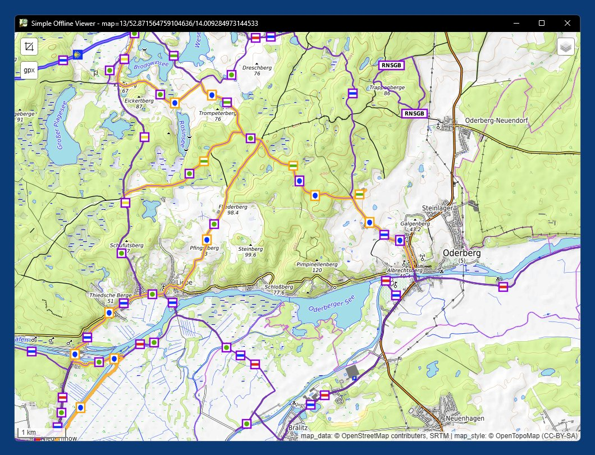
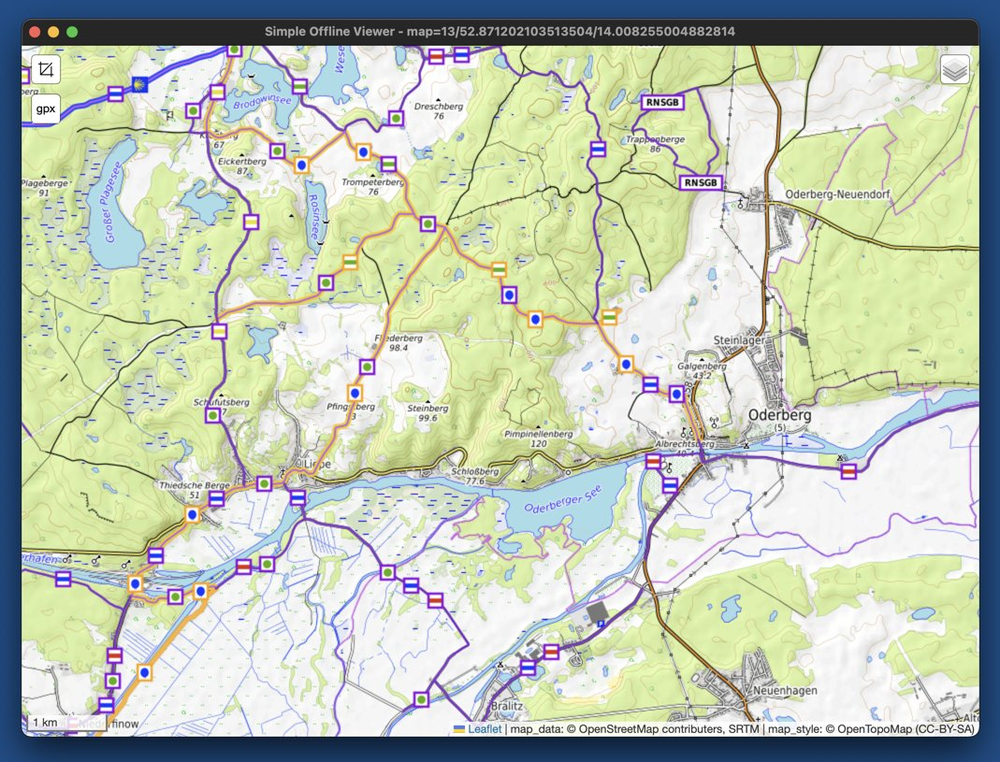

# OpenTopoGermany

The actual purpose of this repository is not the code of the little demo app for Windows and macOS written in Python, but to provide the [disk images](https://github.com/59de44955ebd/OpenTopoGermany/releases/tag/disk_images) listed below for download. The disk images contain raster tiles (.png) of [OpenTopoMap](https://opentopomap.org/) and [Lonvia](https://github.com/waymarkedtrails) cycling/hiking trail overlays for entire Germany up to zoom level 14 resp. 13. Those tiles are meant for usage in **webview-based but offline applications**, like e.g. a hiking (planning) app that also works when a user can't rely on a stable internet connection.

All disk images are raw ".img" (dd) images with a FAT32 filesystem and an additional VHD footer which also makes them valid .vhd files. Therefore they can be mounted easily both in Windows 10/11 and macOS simply by double-clicking them in Explorer resp. Finder (or by selecting "Mount..." from the context menu). To make the images macOS/Finder-compatible just remove the trailing ".vhd" from their filenames so that they have the extension ".img" instead. Finder/hdiutil doesn't mind the additional VHD footer and just ignores it.

Map/tile providers generally don't like users to mass download tiles from their servers, but sometimes you have no other choice if the provider doesn't offer a complete dump e.g. as .zip file. So that's the purpose of this repository, to reduce the load of those providers. In addition, given the overhead of HTTP requests, downloading a single large disk image file is surely much more efficient than downloading hundreds of thousands individual .png files, so this propably also saves energy/climate.

## Tile disk images

### Tiles up to zoom level 14

- tiles_germany_otm_14.img.vhd.zip (7.29 GB) - OpenTopoMap raster tiles of Germany 

  Due to a 2 GB file size limit per indiviual GitHub release file this .zip file is split into 4 parts:

  - [tiles_germany_otm_14.img.vhd.part1of4.zip](https://github.com/59de44955ebd/OpenTopoGermany/releases/download/disk_images/tiles_germany_otm_14.img.vhd.part1of4.zip) (1.95 GB)
  - [tiles_germany_otm_14.img.vhd.part2of4.zip](https://github.com/59de44955ebd/OpenTopoGermany/releases/download/disk_images/tiles_germany_otm_14.img.vhd.part2of4.zip) (1.95 GB)
  - [tiles_germany_otm_14.img.vhd.part3of4.zip](https://github.com/59de44955ebd/OpenTopoGermany/releases/download/disk_images/tiles_germany_otm_14.img.vhd.part3of4.zip) (1.95 GB)
  - [tiles_germany_otm_14.img.vhd.part4of4.zip](https://github.com/59de44955ebd/OpenTopoGermany/releases/download/disk_images/tiles_germany_otm_14.img.vhd.part4of4.zip) (1.43 GB)

  After download run the following in CMD/Terminal to join the 4 parts to a single valid .zip file:


  Windows (CMD):
  ```
  copy /b tiles_germany_otm_14.img.vhd.part1of4.zip + tiles_germany_otm_14.img.vhd.part2of4.zip + tiles_germany_otm_14.img.vhd.part3of4.zip + tiles_germany_otm_14.img.vhd.part4of4.zip tiles_germany_otm_14.img.vhd.zip
  ```

  macOS (Terminal):
  ```
  cat tiles_germany_otm_14.img.vhd.part*.zip > tiles_germany_otm_14.img.vhd.zip
  ```
- [tiles_germany_cycling_14.img.vhd.zip](https://github.com/59de44955ebd/OpenTopoGermany/releases/download/disk_images/tiles_germany_cycling_14.img.vhd.zip) (552 MB) - cycling trail overlay raster tiles of Germany

- [tiles_germany_hiking_14.img.vhd.zip](https://github.com/59de44955ebd/OpenTopoGermany/releases/download/disk_images/tiles_germany_hiking_14.img.vhd.zip) (610 MB) - hiking trail overlay raster tiles of Germany

### Tiles up to zoom level 13 (smaller but less details)

- [tiles_germany_otm_13.img.vhd.zip](https://github.com/59de44955ebd/OpenTopoGermany/releases/download/disk_images/tiles_germany_otm_13.img.vhd.zip) (1.7 GB) - OpenTopoMap raster tiles of Germany 

- [tiles_germany_cycling_13.img.vhd.zip](https://github.com/59de44955ebd/OpenTopoGermany/releases/download/disk_images/tiles_germany_cycling_13.img.vhd.zip) (214 MB) - cycling trail overlay raster tiles of Germany

- [tiles_germany_hiking_13.img.vhd.zip](https://github.com/59de44955ebd/OpenTopoGermany/releases/download/disk_images/tiles_germany_hiking_13.img.vhd.zip) (247 MB) - hiking trail overlay raster tiles of Germany

## Demo app

"Simple Offline Viewer" is a simple and lightweight demo desktop application for Windows and macOS. It's written in Python and based on [pywebview](https://github.com/r0x0r/pywebview) and [Leaflet](https://leafletjs.com/).

Its purpose is to demonstrate how those disk images can be used in a desktop app. The app scans all mounted (virtual) disks/volumes and looks for a "tiles" directory directly in their root directory. If found, a subdirectory called "otm" is used for the base layer and subdirectories called "cycling" and "hiking" for the overlay layers. Obviously this could easily be extended to support additional base and overlay layers provided by other mounted disk images.

Usage:

- Mount either the level 14 or level 13 otm disk image, and optionally also one or both corresponding trail overlay disk image(s).
- Run "simple-offline-viewer.exe" in Windows resp. "simple-offline-viewer.app" in macOS.
- If you mounted a disk image after starting the application, select "Reload" from the webview's context menu to make the application aware of the new offline tile source.

Features:

- View a topographic map of entire Germany without requiring an internet connection. This only requires the otm image to be mounted.
- Toggle fullscreen mode with F11
- If the trails image is also mounted, you can show/hide cycling and/or hiking trails using the control in the top right corner.
- Distances can be measured using the measure control in the top left corner.
- .gpx tracks can be loaded either by dropping them into the application window or clicking on the ".gpx" control.

## Screenshots

Demo app "Simple Offline Viewer" in Windows 11   


Demo app "Simple Offline Viewer" in macOS 13   

